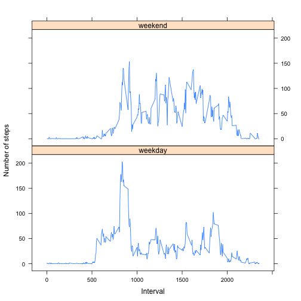

```r
library(dplyr)
library(ggplot2)
library(lattice)
```

## Loading and preprocessing the data

The data for this assignment is stored in the `data` directory.

Assuming the `activity.zip` assessment zipfile exists, unzip it (creates a `activity.csv` dataset file), and then load the `activity.csv` and parse the `date` column as `Date` objects.


```r
unzip('activity.zip')
data <- read.csv('activity.csv', stringsAsFactors = FALSE)
data$date <- as.Date(data$date, format = "%Y-%m-%d")

head(data)
```

```
##   steps       date interval
## 1    NA 2012-10-01        0
## 2    NA 2012-10-01        5
## 3    NA 2012-10-01       10
## 4    NA 2012-10-01       15
## 5    NA 2012-10-01       20
## 6    NA 2012-10-01       25
```

## What is mean total number of steps taken per day?
Compute the total number of steps taken per day:


```r
tot_steps_per_day <- data %>%
  filter(!is.na(steps)) %>%
  group_by(date) %>%
  summarise(tot = sum(steps)) %>%
  select(date, tot)

head(tot_steps_per_day)
```

```
## Source: local data frame [6 x 2]
## 
##         date   tot
##       (date) (int)
## 1 2012-10-02   126
## 2 2012-10-03 11352
## 3 2012-10-04 12116
## 4 2012-10-05 13294
## 5 2012-10-06 15420
## 6 2012-10-07 11015
```

Plot a histogram of the total number of steps taken each day:


```r
with(tot_steps_per_day,
     barplot(tot, names.arg = date))
title(main = "Histogram of the total number of steps taken each day",
      xlab = "Day", ylab = "number of steps per day")
```

 

Calculate and report the mean and median of the total number of steps taken per day:


```r
mean_with_na <- mean(tot_steps_per_day$tot)
median_with_na <- median(tot_steps_per_day$tot)
```


```r
c(mean_with_na=mean_with_na, median_with_na=median_with_na)
```

```
##   mean_with_na median_with_na 
##       10766.19       10765.00
```

## What is the average daily activity pattern?
Compute the average daily pattern (filtering out the `NA`s):


```r
pattern <- data %>%
  filter(!is.na(steps)) %>%
  group_by(interval) %>%
  summarise(avg_steps = mean(steps))

head(pattern)
```

```
## Source: local data frame [6 x 2]
## 
##   interval avg_steps
##      (int)     (dbl)
## 1        0 1.7169811
## 2        5 0.3396226
## 3       10 0.1320755
## 4       15 0.1509434
## 5       20 0.0754717
## 6       25 2.0943396
```

Then make the time series plot:


```r
with(pattern,
     plot(interval, avg_steps,
          type = 'l',
          main = "Average daily activity (num steps) pattern",
          xlab = "5 min interval", ylab = "Average number of steps"))
```

 

Find which 5-minute interval (on average across all the days in the dataset) contains the maximum number of steps:


```r
which(pattern$avg_steps == max(pattern$avg_steps))
```

```
## [1] 104
```

## Imputing missing values
Calculate and report the total number of missing values in the dataset (i.e. the total number of rows with `NA`s):


```r
sum(!complete.cases(data))
```

```
## [1] 2304
```

Strategy for filling the missing `steps` values: 'last observation carried forward', and then 'next observation carried backward' as implemented in the `zoo` package. I think this is the most simple and reasonable for time series data.

Create a new dataset with the missing data filled in (don't forget to first install the package `zoo`):


```r
library(zoo)
data$steps <- na.locf(data$steps, na.rm = FALSE)
data$steps <- na.locf(data$steps, na.rm = FALSE, fromLast = TRUE)
```

and check that there are no more missing values


```r
sum(is.na(data$steps)) == 0
```

```
## [1] TRUE
```

Now missing data has been imputed, make again a histogram of the total number of steps taken each day (same as previously):


```r
tot_steps_per_day <- data %>%
  group_by(date) %>%
  summarise(tot = sum(steps)) %>%
  select(date, tot)

with(tot_steps_per_day,
     barplot(tot, names.arg = date))
title(main = "Histogram of the total number of steps taken each day",
      xlab = "Day", ylab = "number of steps per day")
```

 

and re-calculate and report the mean and median of the total number of steps taken per day:


```r
mean_imputed <- mean(tot_steps_per_day$tot)
median_imputed <- median(tot_steps_per_day$tot)
```


```r
c(mean_imputed=mean_imputed, median_imputed=median_imputed)
```

```
##   mean_imputed median_imputed 
##        9354.23       10395.00
```

These values differ from the estimates from the first part of the assignment:


```r
res <- data.frame(mean = c(mean_with_na, mean_imputed),
                  median = c(median_with_na, median_imputed))
rownames(res) <- c('with_na', 'imputed')
res
```

```
##             mean median
## with_na 10766.19  10765
## imputed  9354.23  10395
```

The imputed values being mostly zeros: the mean decreases by more than 10%, and the mean is not much affected with a decrease of about 3%.


```r
(res[2, ] - res[1, ]) / res[1, ]
```

```
##               mean      median
## imputed -0.1311475 -0.03437065
```

## Are the differences in activity patterns between weekdays and weekends?
Create a new factor variable in the dataset with two levels – “weekday” and “weekend” indicating whether a given date is a weekday or weekend day.


```r
data <- data %>%
  mutate(day_cat = ifelse(weekdays(date) %in% c("Saturday", "Sunday"),
                          "weekend", "weekday"))
data$day_cat <- factor(data$day_cat)
```

Make a panel plot containing a time series plot of the 5-minute interval and the average number of steps taken, averaged across all weekday days or weekend days.

First create the mean per interval (and per weekend/weekday):


```r
final <- data %>%
  group_by(day_cat, interval) %>%
  summarise(mean_steps = mean(steps)) %>%
  ungroup()

head(final)
```

```
## Source: local data frame [6 x 3]
## 
##   day_cat interval mean_steps
##    (fctr)    (int)      (dbl)
## 1 weekday        0 2.02222222
## 2 weekday        5 0.40000000
## 3 weekday       10 0.15555556
## 4 weekday       15 0.17777778
## 5 weekday       20 0.08888889
## 6 weekday       25 1.31111111
```

As suggested with the example, the graph is done with `lattice`.


```r
xyplot(mean_steps ~ interval | day_cat, data = final,
       type = 'l', layout = c(1,2),
       xlab = "Interval",
       ylab = "Number of steps")
```

 

That's it. Best regards.
